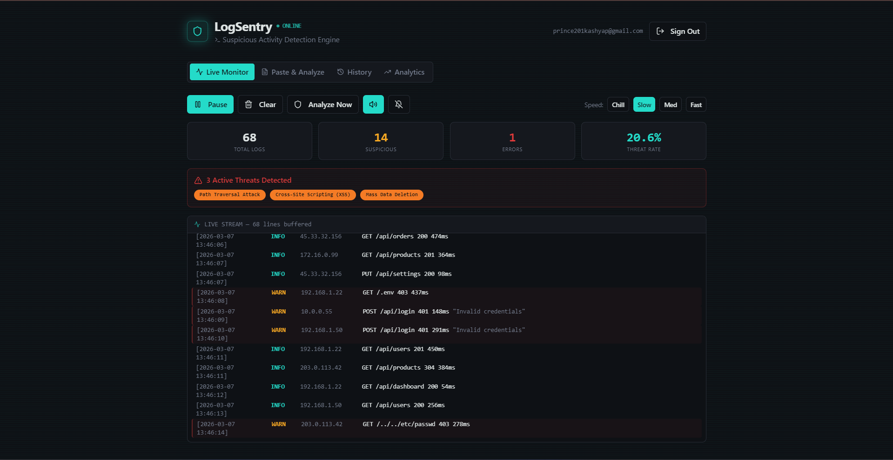
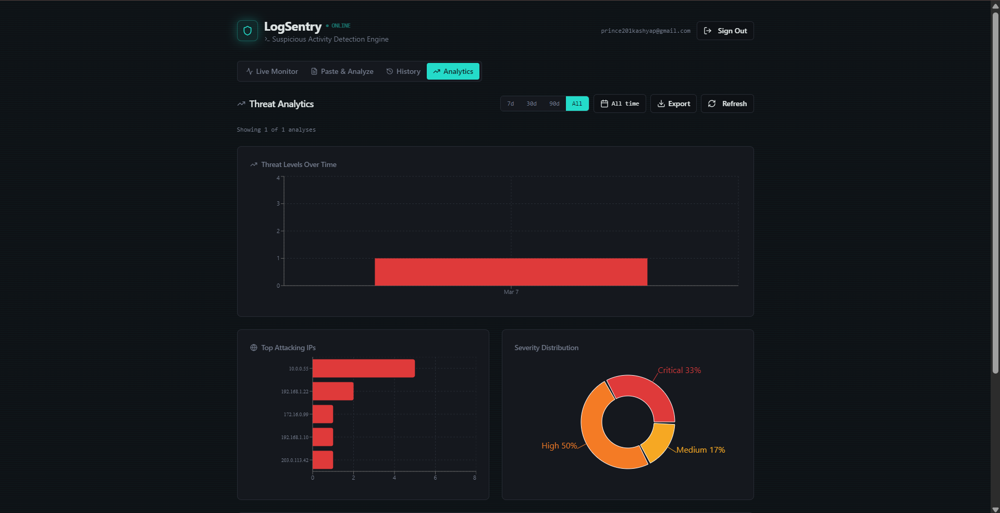
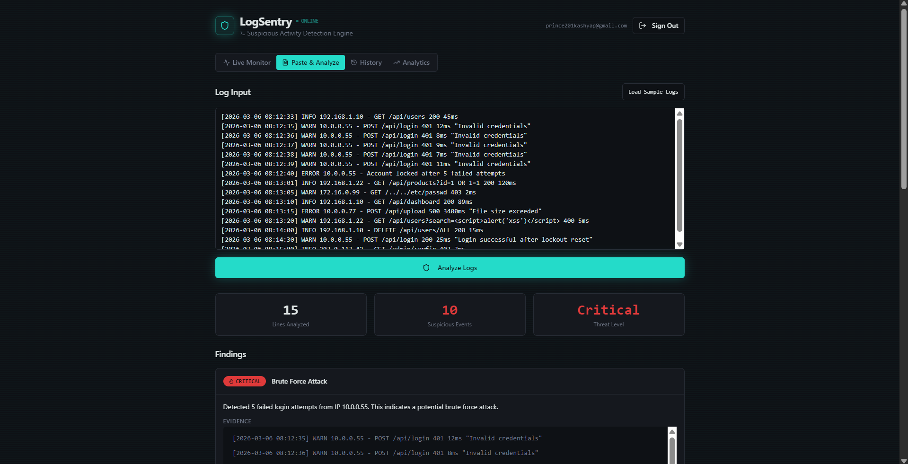

# LogSentry – Suspicious Activity Detection System

LogSentry is a cybersecurity log analysis platform that analyzes server logs and detects suspicious activities such as brute force attacks, SQL injection, XSS, and path traversal attempts.

This system helps security analysts identify potential threats through real-time monitoring and security analytics dashboards.

---

## Live Demo

https://logsentry-security.lovable.app

---

## Features

- Real-time log monitoring
- Suspicious IP detection
- Attack severity classification
- Threat analytics dashboard
- Visualization of attacking IPs
- Detection of common web attacks
- Export security reports (CSV / PDF)

---

## Supported Attack Detection

LogSentry can detect patterns related to:

- Brute Force Login Attempts
- SQL Injection
- Cross-Site Scripting (XSS)
- Path Traversal Attacks
- Suspicious IP activity

Example attack patterns:

| Attack Type | Example Pattern |
|--------------|----------------|
| Brute Force | Multiple failed login attempts |
| SQL Injection | `' OR 1=1 --` |
| XSS | `` |
| Path Traversal | `../../etc/passwd` |

---

## System Architecture

1. Server logs are collected or uploaded.
2. Logs are parsed using pattern detection rules.
3. Suspicious activity is detected using security patterns.
4. Threat data is processed and analyzed.
5. Results are visualized in the security analytics dashboard.

---

## Screenshots

### Dashboard

### Threat Analytics

### Live Log Monitoring

---

## Technologies Used

- Python (Log analysis & detection logic)
- React
- TypeScript
- Tailwind CSS
- Vite
- Security log parsing

---

## Installation

Clone the repository:

git clone https://github.com/Prince-7626/logsentry-security.git

Navigate to project folder:

cd logsentry-security

Install dependencies:

npm install

Run development server:

npm run dev

---

## Future Improvements

- AI based anomaly detection
- Integration with SIEM tools
- Email alerts for critical attacks
- Support for multiple log formats
- Real-time attack notification system
- Automated threat intelligence integration

---

## Security Use Cases

LogSentry can be used for:

- Monitoring web server logs
- Detecting suspicious user activity
- Identifying attack patterns
- Security operations center (SOC) monitoring
- Threat investigation and analytics

---

## Author

Prince Kashyap  
(CyberPrince)

---

## Project Purpose

This project was developed as a cybersecurity log analysis system to demonstrate threat detection techniques and security monitoring dashboards.
